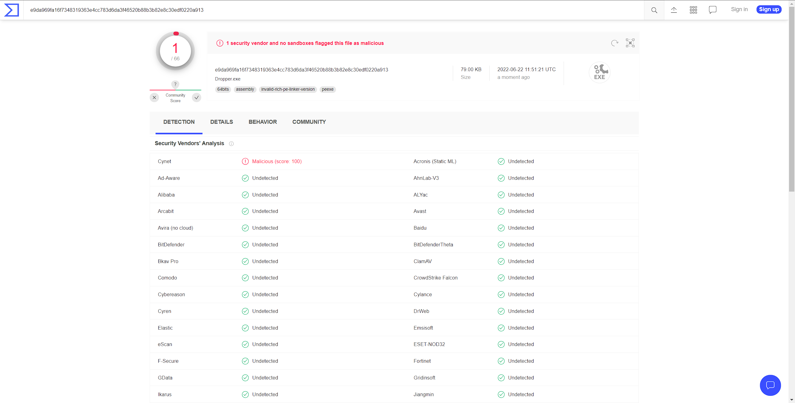

# Dropper

Definition of a dropper: _"A dropper is a kind of Trojan that has been designed to "install" some sort of malware to a target system. The malware code can be contained within the dropper in such a way as to avoid detection by virus scanners or the dropper may download the malware to the target machine once activated. Wikipedia"_

## FAQ 📖

- In what way is it unique from other droppers? It - is not designed to be a unique dropper that would somehow differentiate from similar projects, however, it is - designed to be kept simple that could be easily editable without having to understand intricate details and overwhelm yourself.

## Features 🎇

- Simplistically editable codebase without the need of putting much effort into the code.
- Easily editable config
- Lightweight and super fast (also depends on the downloading server)
- Low detection rate [Virus Total Scan](https://www.virustotal.com/gui/file/e9da969fa16f7348319363e4cc783d6da3f46520b88b3b82e8c30edf0220a913)  
  
